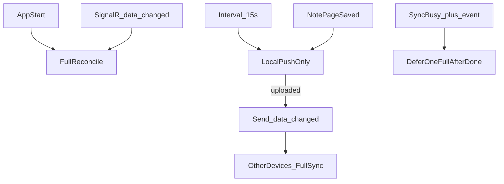

# Notes and Cloud sync separation

## Contracts

### Notes (mostly offline)

- Notes primarily **reads and writes the local filesystem** (Windows folder / Android SAF tree).
- Notes must not show cloud-aware status.
- When the open page’s file changes on disk, Notes reloads:
  - **Windows:** `NotesIndexFileWatcher` + reload when Notes tab activates (if editor is clean)
  - **Android:** disk hash poller (~1.5s) on the open note URI
- If the editor has unsaved edits when disk changes, show a **disk conflict** dialog (reload vs keep edits).
- After a note page is **saved to disk**, Cloud runs a **local-only push** (same as the interval) so edits leave the device promptly.

### Cloud (two sync modes)

Cloud owns mapped folders: **FS ↔ local sync metadata ↔ server file entities**.

| Trigger | Mode |
|---------|------|
| App start / login | **Full reconcile** (scan local + remote → upload / download / Conflict) |
| **Map local folder** | **Full reconcile** into the **existing** cloud folder id (never creates a new mapped-root folder) |
| SignalR `data_changed` | **Full reconcile** (same as start) |
| Manual Sync | **Full reconcile** |
| Periodic timer (**15s**) | **Local-only push** (no remote scan/download; upload when local ≠ meta). If metadata for a mapping is empty, upgrades to **full reconcile** for that mapping first. |
| Note page saved | **Local-only push** (same empty-meta guard) |
| Force Upload / Force Download | Force overwrite (push also sends `data_changed`) |

**Not triggers:** filesystem watchers, window Activate, WorkManager periodic jobs.

**After a successful local-only push that uploaded something** (or Force Upload): send SignalR `data_changed` to the same user so other devices run a full reconcile. Full sync itself does **not** send `data_changed` (avoids ping-pong).

**Exclusivity:** one sync at a time.

- Interval / note-save local-push is **skipped** while any sync is running (no stack).
- If `data_changed` arrives while sync is busy → **skip** that event and run **one coalesced full sync** after the current sync finishes.

Local sync metadata (client-only): `contentHash` (SHA-256), `sizeBytes`, `remoteId`, `relativePath`, `remoteUpdateTime`.  
Server stores file bytes + entity `UpdateTime` — **no** mirrored content-hash API.

## Hash decide rules (full reconcile)

| Situation | Action |
|-----------|--------|
| local == remote | Skip (seed meta hash) |
| local == meta, remote ≠ meta | Read (download) |
| remote == meta, local ≠ meta | Write (upload) |
| empty meta and local ≠ remote | **Conflict** |
| both ≠ meta | **Conflict** |

Conflicts throw `SyncConflictException` and surface in a popup. Resolve with **Force Upload** or **Force Download**.

Failed remote download throws `SyncException` (no silent skip).

Local-only push does **not** download or Conflict-check remote; it uploads when local content differs from meta (and applies local adds/renames/removes against meta). It **never** seeds a brand-new mapping from an empty metadata store — that path runs full reconcile first so existing remote children are adopted.

## Force repair

- **Upload all** — overwrite server from local; meta follows local; notifies other devices.
- **Download all** — overwrite local from server; meta follows remote.

**Windows:** Cloud tab → Synced folders (expanded) → Upload all / Download all.  
**Android:** Settings → Mapped folders → Upload all / Download all (confirm dialog + status line).

## How an edit propagates

1. User edits a note → Notes writes `index.html` to disk → local-only Cloud push (or within ~15s interval).
2. If anything was uploaded → `data_changed` to the user’s other devices.
3. Other device full reconcile downloads → writes disk.
4. Other device Notes watcher/poller/tab-activate reloads the open page.

## Messenger

Messenger uses the same SignalR hub for inbound commands (`message_sent`, etc.) and REST `api/commands/send` for outbound notify. Unrelated to Cloud file sync except sharing the connection.

## Related code

- Windows Notes: `NotesViewModel`, `NotesView` + `NotesIndexFileWatcher`
- Windows Cloud: `CloudMappedSyncCoordinator`, `SyncEngine.PushLocalChangesAsync` / `ReconcileAllAsync`
- Android Notes: `MainViewModel` persist + disk poller → `requestLocalPush`
- Android Cloud: `:sync` `SyncEngine`, `requestFullSync` / `requestLocalPush`, Settings force actions
